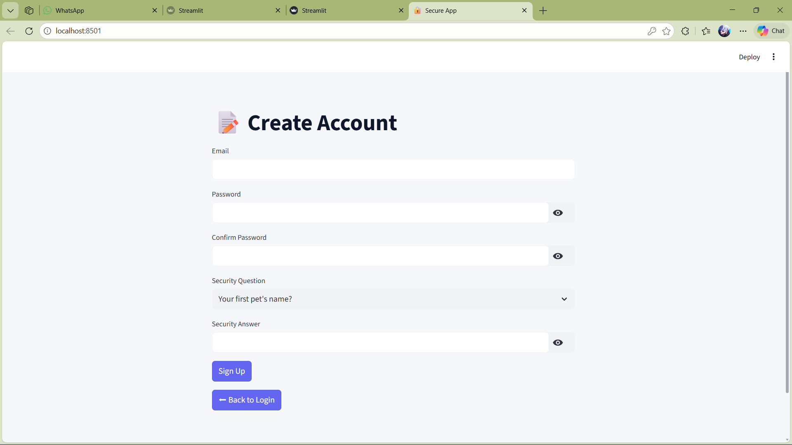
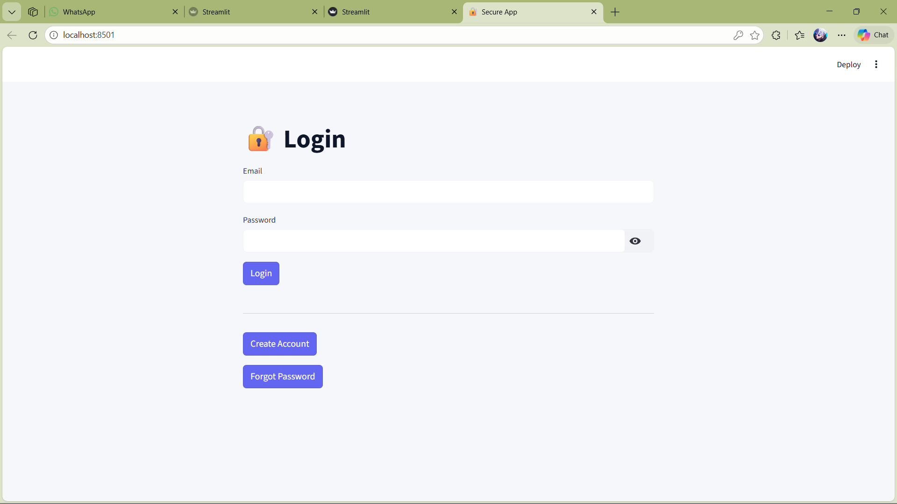
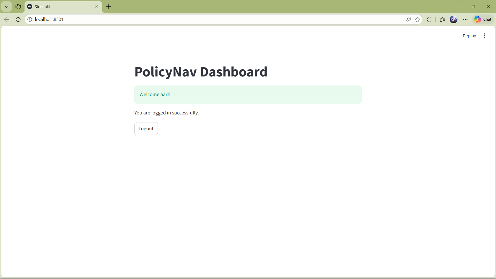
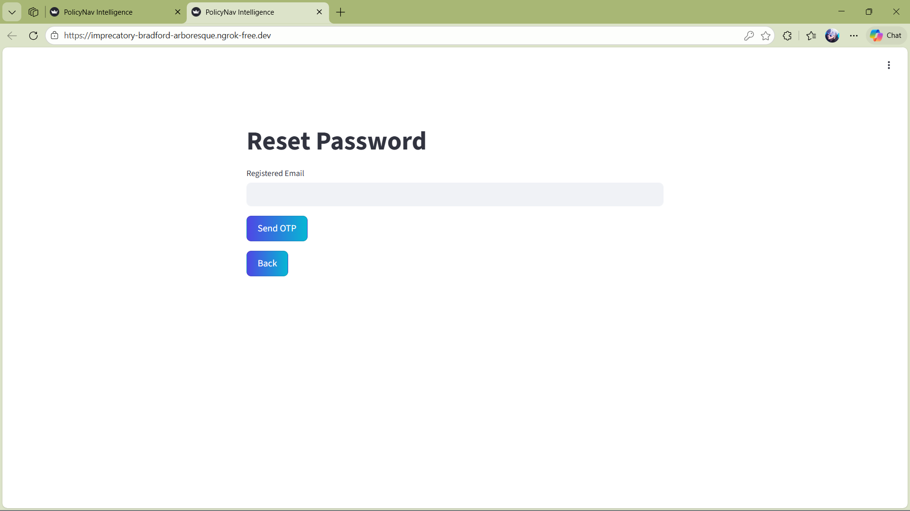

# 🚀 Infosys LLM – Secure Readability Analysis System

A secure web-based Readability Analysis Dashboard built using **Streamlit**, featuring authentication with Email OTP verification, password recovery, file upload support, and professional readability metrics visualization.

---

## 📖 Project Overview

Infosys LLM is designed to:

- Provide secure user authentication
- Analyze text readability using standard metrics
- Interpret reading levels professionally
- Support text and document uploads
- Display interactive visual dashboards

This system simulates a company-level product with structured UI and validated workflows.

---

## 🔐 Authentication Features

- ✅ User Signup with:
  - Email format validation
  - Strong password validation
  - Security Question & Answer
- ✅ Email OTP Verification (Gmail App Password)
- ✅ Secure Password Hashing (bcrypt)
- ✅ Login System
- ✅ Forgot Password with Security Question Validation
- ✅ SQLite Database Integration

---

## 📊 Readability Metrics Implemented

The system calculates the following 5 metrics:

1. **Flesch Reading Ease (FRE)**
2. **Flesch-Kincaid Grade Level (FKGL)**
3. **Gunning Fog Index**
4. **SMOG Index**
5. **Automated Readability Index (ARI)**


## 🎨 UI & Design Highlights

- Corporate-style clean layout
- Interactive Plotly visualizations
- Professional color palette
- Clear validation messages
- No black UI artifacts
- Button-based navigation (no toggle confusion)

---

## 🛠 Technologies Used

- Python
- Streamlit
- SQLite
- bcrypt
- textstat
- Plotly
- PyPDF2 / pypdf
- python-docx

---

## ⚙ Installation & Setup

### 1️⃣ Clone Repository

```bash
git clone https://github.com/Aarti525/Infosys_Springboard_PolicyNav_Public-_Policy_Navigation_Using_AI-.git
cd milestone1
```

### 2️⃣ Create Virtual Environment

```bash
python -m venv venv
venv\Scripts\activate
```

### 3️⃣ Install Dependencies

```bash
pip install streamlit bcrypt textstat plotly PyPDF2 python-docx
```

### 4️⃣ Run Application

```bash
streamlit run app.py
.\ngrok http 8501
```

---

## 📧 Email OTP Configuration

To enable OTP functionality:

1. Enable **2-Step Verification** in Gmail
2. Generate a **Gmail App Password**
3. Replace inside `app.py`:

```python
EMAIL_ADDRESS = "your_email@gmail.com"
EMAIL_PASSWORD = "your_generated_app_password"
```


---

## 🗄 Database Information

- SQLite database (`users.db`) auto-generates on first run
- Stores user credentials securely
- Passwords are hashed using bcrypt
- Includes role-ready structure (admin flag supported)

---

## 🔒 Validations Implemented

- Email format validation
- Password strength enforcement
- Security answer verification
- OTP verification before login
- Minimum text length validation for analysis
- File type validation for uploads


## 👨‍💻 Developed For

Milestone 1 Academic Submission  
Infosys LLM – Readability Dashboard


## Screenshots
### Signup Page


### Login Page


### Dashboard


### Forgot Password


