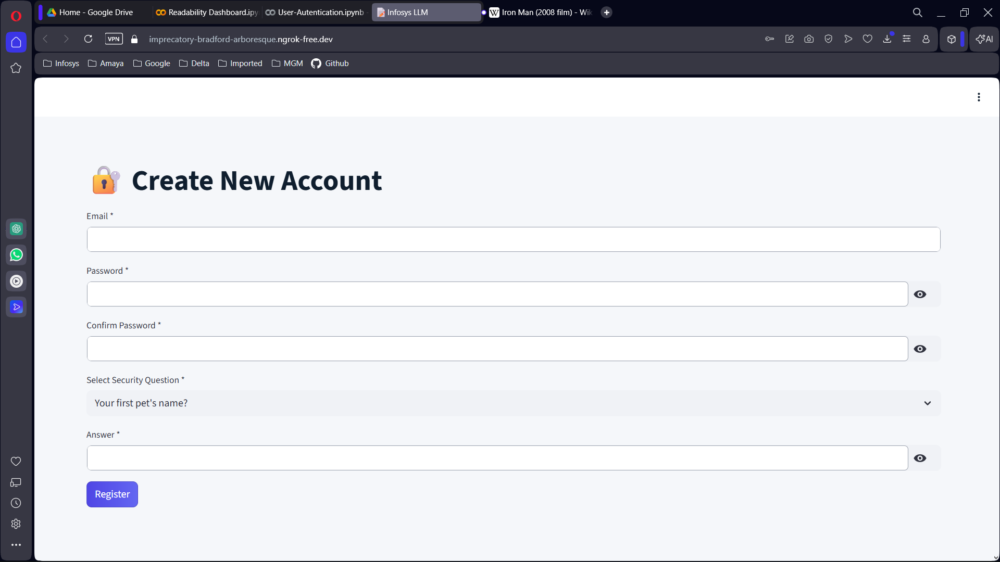
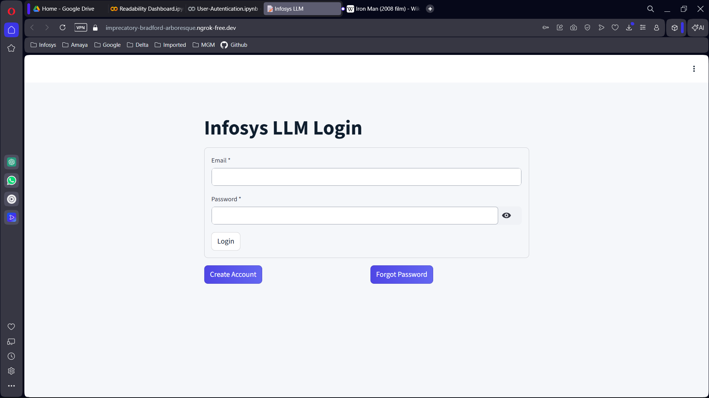
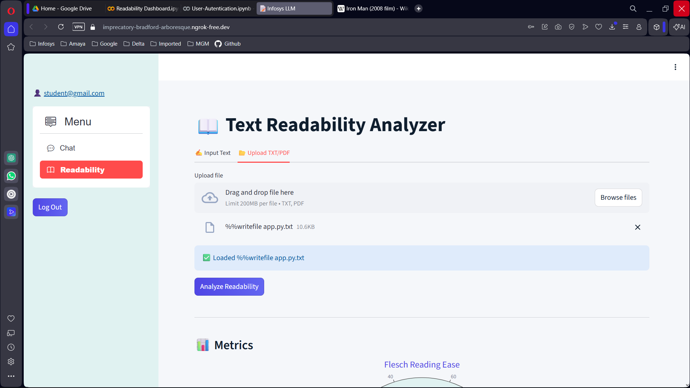
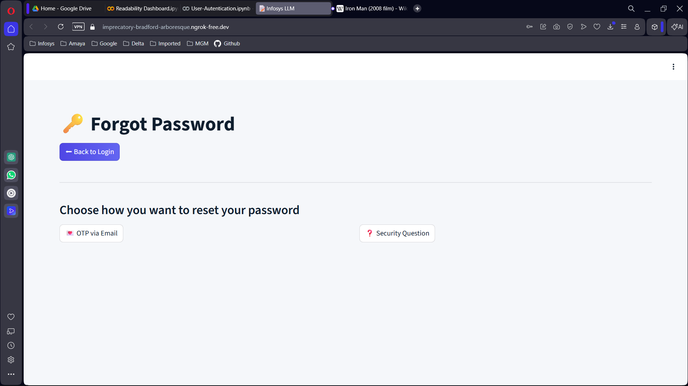

# 📘 Milestone 2 – Secure Authentication & Readability System

## 📌 Project Title
**Infosys LLM – Secure Auth, Chat & Readability Analyzer**

---

## 🎯 Milestone 2 Objective
The objective of **Milestone 2** is to design and implement a **secure authentication system** along with a **text readability analysis module**, while improving UI/UX and ensuring proper validations and security mechanisms.

This milestone focuses on:
- Secure user authentication
- Password recovery mechanisms
- Database integration
- Readability metrics visualization
- Improved UI (light, colorful theme)

---

## 🛠️ Technologies Used

| Category | Technology |
|--------|------------|
| Frontend | Streamlit |
| Backend | Python |
| Database | SQLite3 |
| Security | bcrypt, JWT |
| Email | SMTP (Gmail App Password) |
| Visualization | Plotly |
| File Handling | PyPDF2 |
| Deployment | Google Colab + Ngrok |

---

## 🔐 Authentication Features

### ✅ User Registration
- Email validation
- Password strength validation
- Confirm password field
- Security question & answer setup
- Encrypted password storage (bcrypt)

### ✅ Login System
- Secure password verification
- Login attempt tracking
- Rate limiting to prevent brute-force attacks

### ✅ Forgot Password (Two Methods)
Users can reset their password using **either**:

#### 1️⃣ OTP via Email
- Secure OTP generation
- OTP sent via Gmail SMTP
- OTP expiry handling

#### 2️⃣ Security Question
- User-defined question during signup
- Hashed answer verification

> Users can choose the reset method using **buttons (not radio buttons)**.

---

## 📖 Readability Analyzer Module

### ✍️ Input Options
- Manual text input
- Upload `.txt` or `.pdf` files

### 📊 Readability Metrics Implemented
- Flesch Reading Ease
- Flesch–Kincaid Grade Level
- SMOG Index
- Gunning Fog Index
- Coleman–Liau Index

### 📈 Visualization
- Interactive **gauge charts** for each metric
- Expandable info section explaining each metric

### 📑 Text Statistics
- Sentence count
- Word count
- Syllable count
- Complex words
- Character count

---

## 🎨 UI / UX Enhancements

- Light theme (no dark mode)
- Colorful buttons
- Consistent layout
- Sidebar navigation using `streamlit-option-menu`
- Back buttons for Signup & Forgot Password pages

---

## 🗄️ Database Design

### Tables Used
- `users`
- `password_history`
- `login_attempts`
- `security_questions`

### Security Practices
- Password hashing using bcrypt
- Security answers hashed
- Old password reuse prevention

---

## 🚀 How to Run the Project

### Step 1: Install Dependencies
```bash
pip install streamlit bcrypt pyjwt plotly PyPDF2 streamlit-option-menu
```

### Step 2: Set Email App Password (Colab)
```python
import os
os.environ['EMAIL_PASSWORD'] = 'YOUR_GMAIL_APP_PASSWORD'
```

### Step 3: Run Database Initialization
```bash
python db.py
```

### Step 4: Run the Application
```bash
streamlit run app.py
```

---

## ✅ Milestone 2 Outcomes

✔ Secure authentication implemented
✔ Password reset via OTP & security question
✔ Readability metrics fully functional
✔ Clean, user-friendly UI
✔ Database integration completed

---

## 👨‍💻 Developed For

Milestone 1 Academic Submission  
Infosys LLM – Readability Dashboard


## Screenshots
### Signup Page


### Login Page


### Dashboard


### Forgot Password



