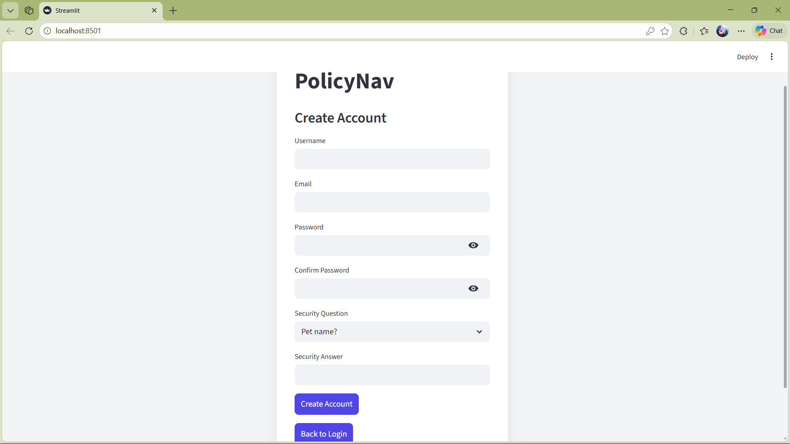
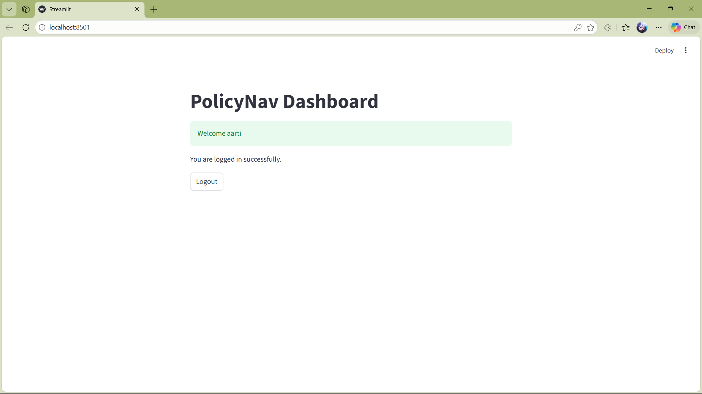
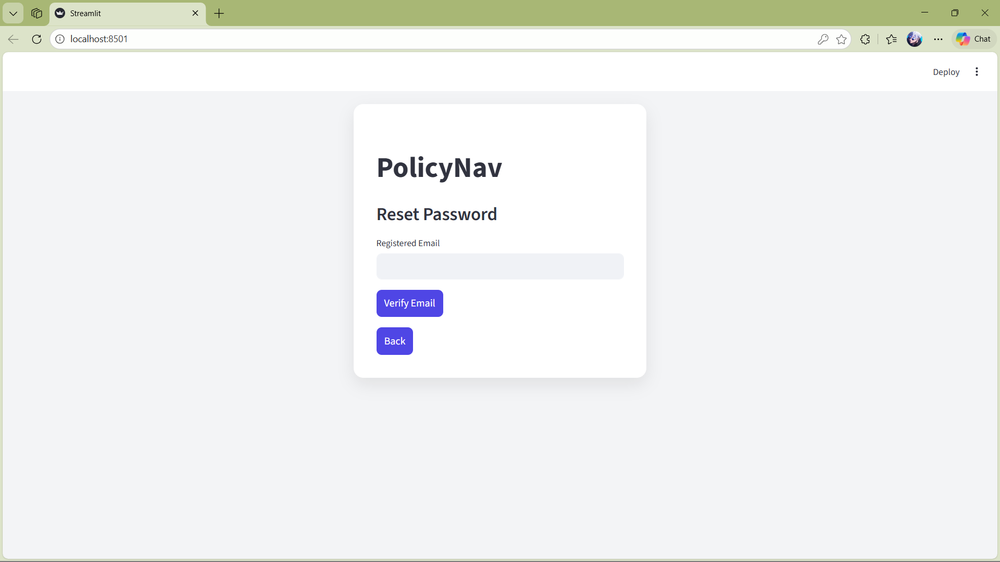

Milestone 1 – Secure User Authentication System
PolicyNav – Infosys Springboard Virtual Internship 6.0 (Batch 13)

Project Overview

This project is developed as part of Milestone 1 of the Infosys Springboard Internship.

The objective of this milestone is to design and implement a secure User Authentication System that will serve as the foundation for the PolicyNav project.

The system includes user registration, secure login using JWT, session handling, password recovery using security questions, and public deployment using Ngrok.

🛠 Technologies Used

Python
Streamlit (Frontend UI)
SQLite (Database)
JWT – JSON Web Token (Authentication)
Bcrypt (Secure Password Hashing)
Ngrok (Public URL Exposure)

Features Implemented
1️.User Signup

Username field

Email validation (proper format check)

Alphanumeric password validation

Confirm password matching

Security question selection

Secure storage in SQLite database

2️.JWT-Based Login System

Email verification

Password verification using bcrypt

JWT token generation after successful login

Secure session handling

3️.Dashboard

Welcome message with username

Logout functionality

Session-based authentication

4️. Forgot Password Flow

Email verification

Display stored security question

Validate security answer

Allow secure password reset

Update hashed password in database

5️.Ngrok Integration

Application exposed using Ngrok

Public HTTPS URL generated for demonstration

How to Run the Project
Step 1: Clone the Repository
git clone <your-repository-link>

Step 2: Create Virtual Environment
python -m venv venv
venv\Scripts\activate

Step 3: Install Dependencies
pip install streamlit pyjwt bcrypt

Step 4: Run the Application
streamlit run app.py

Step 5: Run Ngrok
ngrok http 8501

## Screenshots
### Signup Page

### Login Page

### Dashboard

### Forgot Password

